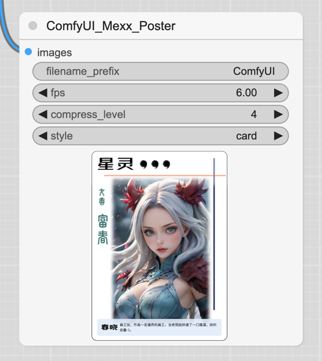

# ComfyUI_Mexx_Poster

## 功能简述

使用HTML模版，对图片进行编辑，形成定制化的图片，比如游戏卡牌、海报、商业广告等。

## 使用图例

- 视频：[海报完事.mp4](image%2F%E6%B5%B7%E6%8A%A5%E5%AE%8C%E4%BA%8B.mp4)
- ComfyUI Workflow文件：[workflow-lcm-poster.json](workflow-lcm-poster.json)

## 生成的效果图

